#Title of project
Deploying staticwebsite amd creating chatbot for it using azure resources

#introduction
Welcome to SF, where fashion transcends the ordinary and becomes an expression of individuality. At SF, we’re dedicated to bringing you the latest trends and timeless pieces that seamlessly blend innovation with classic style. Our curated collections are designed for those who embrace bold fashion statements and seek to redefine their wardrobe with elegance and edge. Explore our diverse range of clothing and accessories that promise to elevate your style and reflect your unique personality. Discover the future of fashion with SF and let every outfit tell your story."

# Project Details
1. Project Demo URL: https://netplay.z8.web.core.windows.net/
2. Demo Video URL:https://youtu.be/ZmnvSiNs7uM?si=l98AEzF8DfS1yXQw
3. GitHub Repository URL: https://github.com/kbjtushar/victory-vault
4. Industry: life style

5. # Roles and responsibilities
1. sai kiran patil(project management) :Manages the web development project.
2. sai pavan(Deployment) :Deployment and maintenance of project infrastructure.
3. vishwaweshwar(Images, logos and chat bot questions) :Responsible for image searching, logo creation and chat bot questions
4. sai pavan and sai kiran patil (Documentation) :Responsible for managing the documentation process.

5. # Azure services used:
1. Azure blob storage
2. Storage account
3. Azure Backup service
4. Azure AI services
5. chatbot
6. Azure Role Based access Control(RBAC)

7. # Problem Statement:
8. # Screenshot’s:
9. # Storageaccount
10. 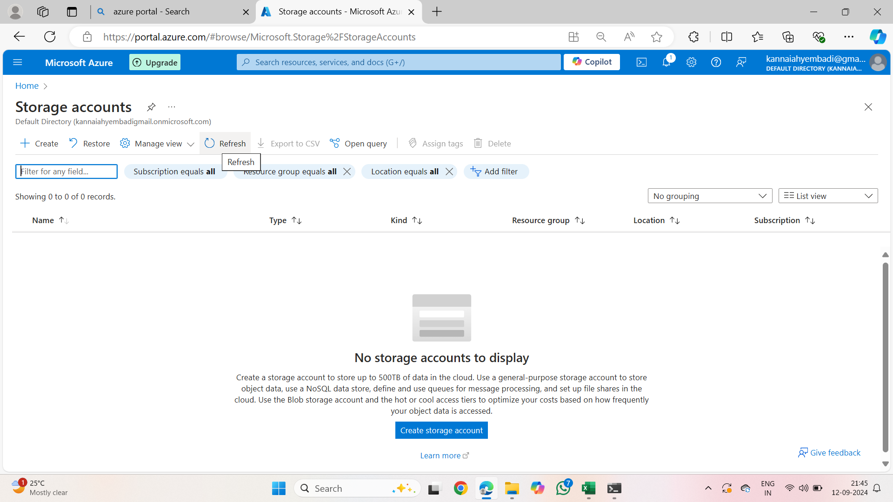

11. # Container
12. 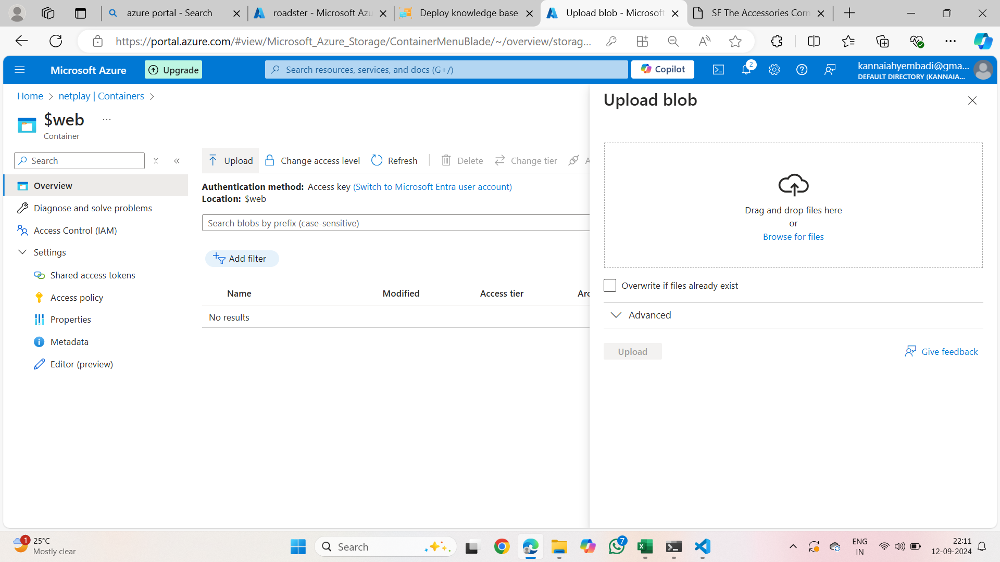

13. # azureaiservices
14. 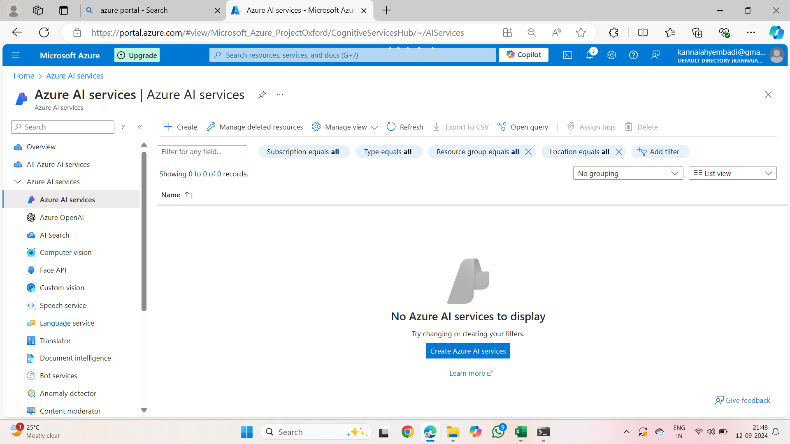

15. # azureresources
16. 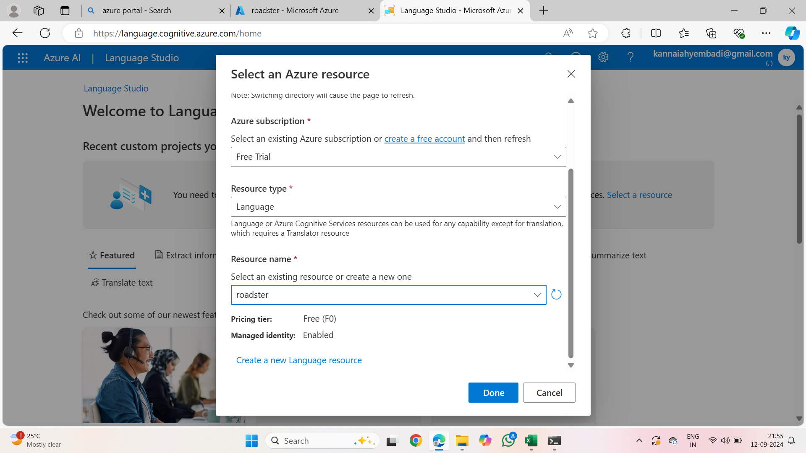

17. # azurebot
18. 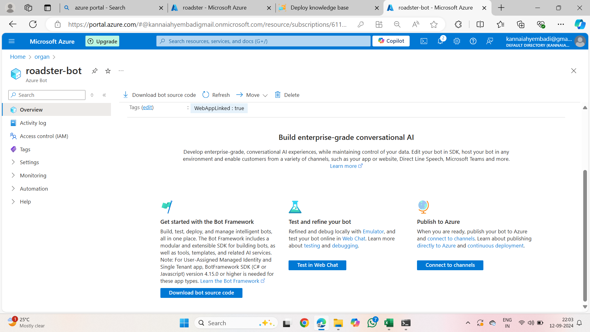

19. # creationoflanguage
20. 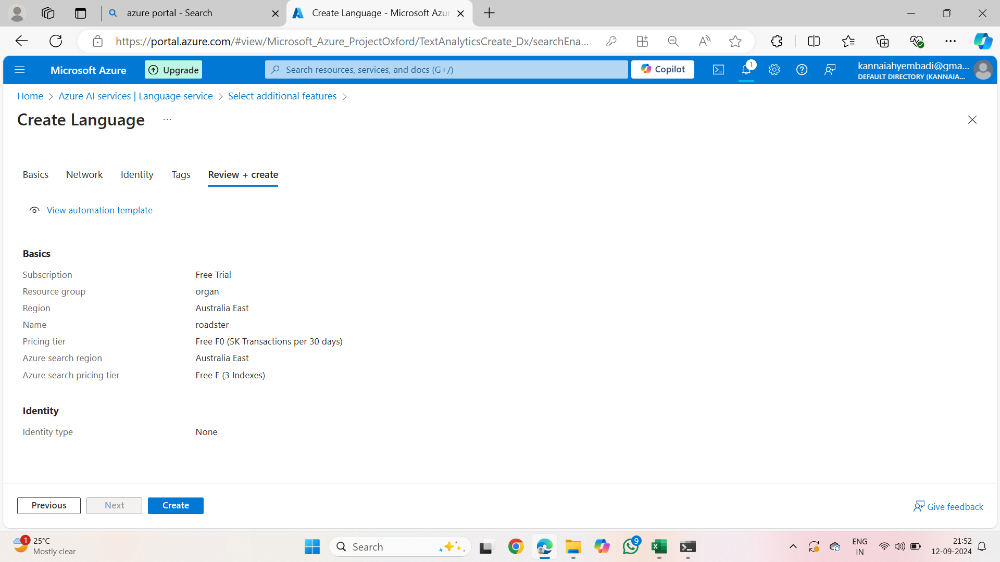

21. # languagestudio
22. 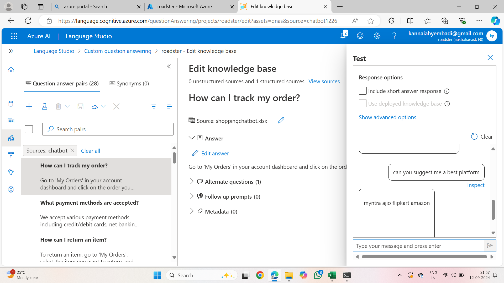

23. # customdeployment
24. 
25. 
26. # deployknowledgebase
31. 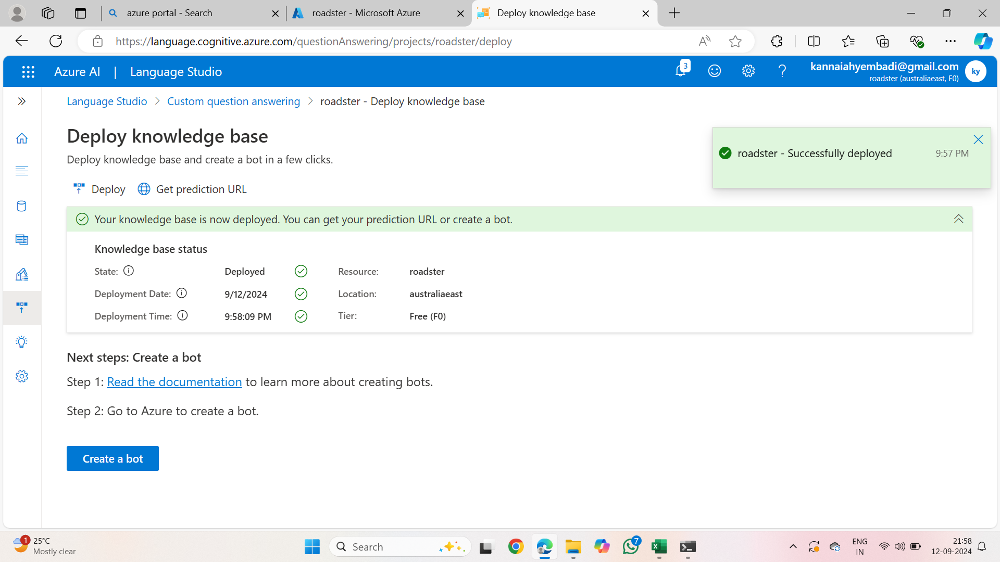
26. 
27. # azurebot1
28. 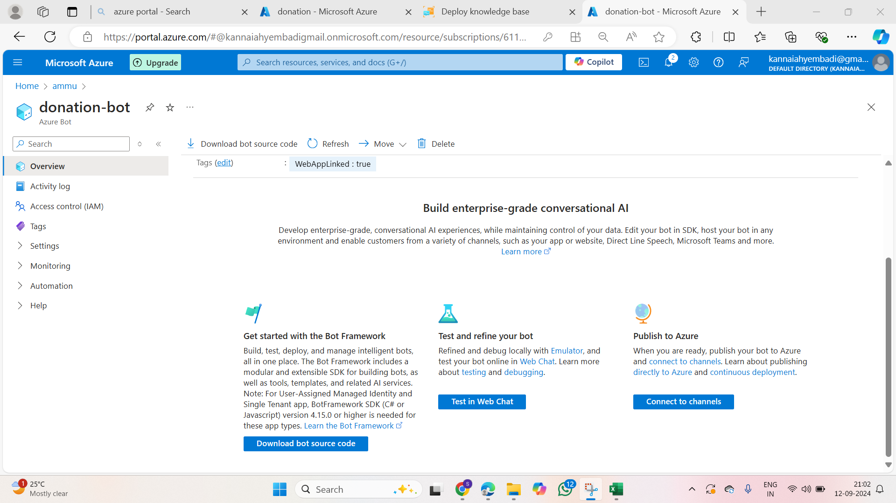

29. # testinwebchat
30. 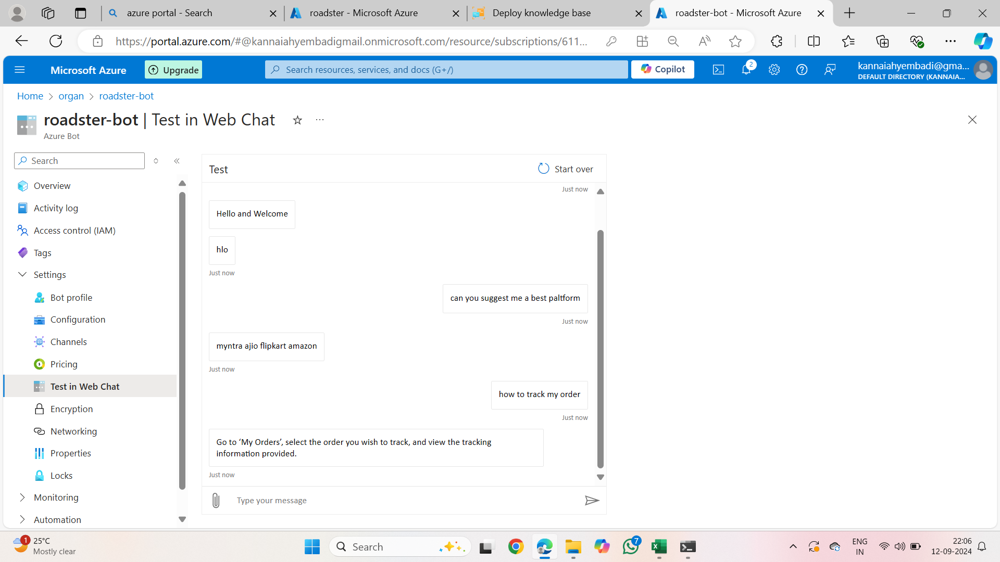
31. 
32. # code
35. 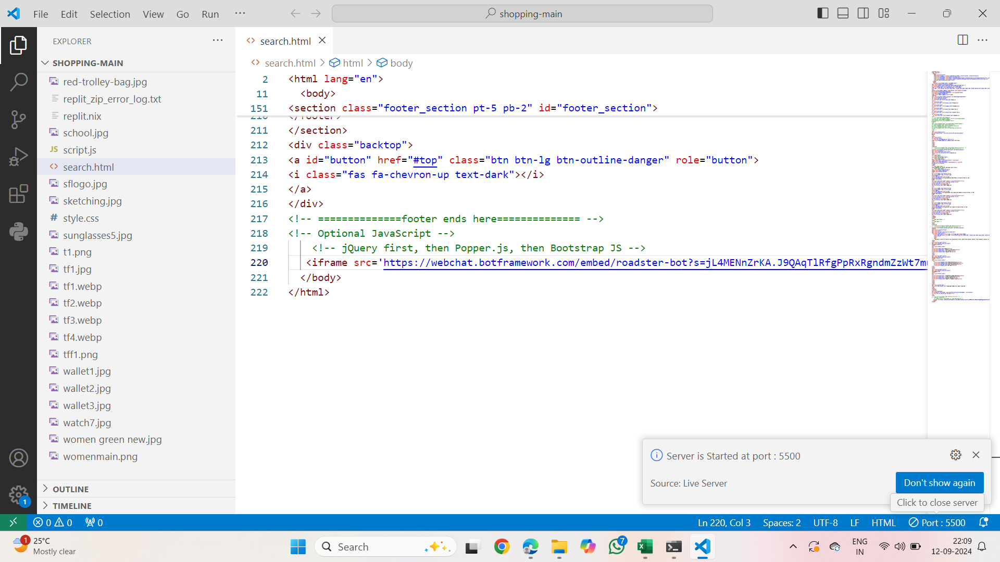

32. # testingcode
33. 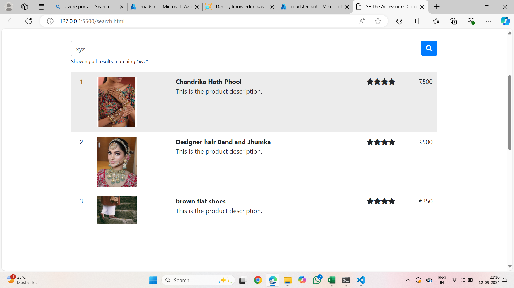
    
    
38. # testingcodeinstaticwebsite
39. 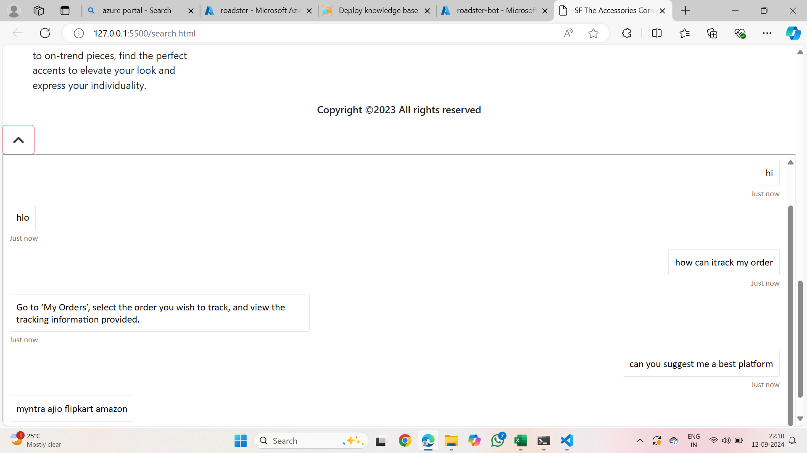

